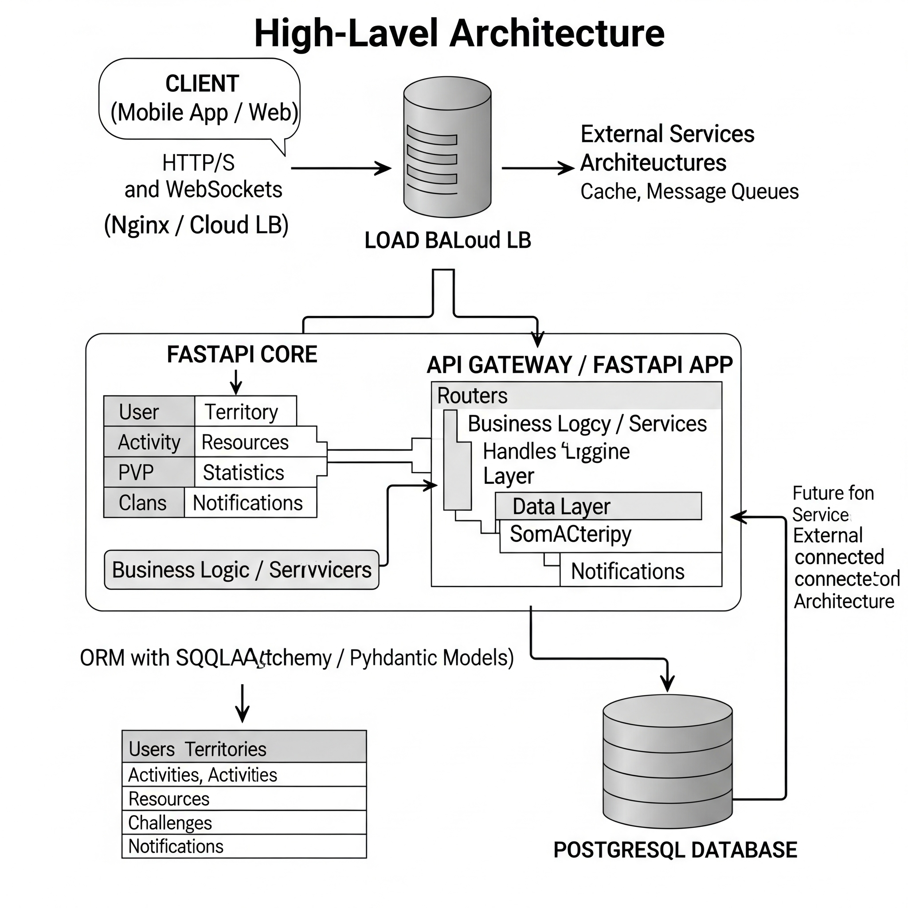

# Fitness Game API: Conquiste o Mundo com Sua Atividade Física!

[](https://opensource.org/licenses/ISC)
[](https://www.repostatus.org/#wip)
[](https://www.python.org/downloads/)
[](https://fastapi.tiangolo.com/)
[](https://www.uvicorn.org/)
[](https://pydantic.dev/)



Este repositório contém a API central para um inovador jogo de fitness que transforma sua atividade física diária em uma aventura competitiva de PvP (Jogador contra Jogador). Desenvolvida com uma arquitetura RESTful escalável, a API integra geolocalização, validação de movimento e elementos sociais para criar uma experiência de jogo imersiva e envolvente.

## Visão Geral

O objetivo deste projeto é criar um jogo de fitness que incentive a atividade física através de mecânicas de jogo envolventes. A API serve como o back-end robusto para todas as interações do jogo, desde o gerenciamento de usuários até as complexas batalhas territoriais e a economia de recursos.

## Funcionalidades Principais

* **Gerenciamento de Usuários**: Cadastro, login, autenticação e edição de perfil de jogadores.
* **Territórios Dinâmicos**: Sistema de conquista, reforço e defesa de áreas no mapa, diretamente ligadas à atividade física do jogador.
* **Rastreamento de Atividades**: Registro preciso de corridas e caminhadas, utilizando dados de GPS e validação por acelerômetro para garantir a autenticidade do movimento.
* **Batalhas PvP**: Mecânicas para iniciar, acompanhar e resolver desafios territoriais entre jogadores.
* **Economia de Recursos**: Geração de recursos a partir de territórios conquistados e um sistema de progressão do jogador baseado nesses recursos.
* **Componentes Sociais**: Funcionalidades para criação e gerenciamento de clãs, participação em desafios de grupo e um feed de eventos sociais.
* **Estatísticas Abrangentes**: Relatórios detalhados de desempenho físico (distância, calorias, vitórias) e estatísticas diárias.
* **Notificações em Tempo Real**: Alertas instantâneos sobre eventos importantes do jogo (ataques, conquistas, etc.), com potencial uso de WebSockets.

## Arquitetura do Projeto

A API é construída com uma abordagem RESTful, focando na escalabilidade e modularidade. A estrutura é organizada por domínios, facilitando a manutenção e o desenvolvimento de novas funcionalidades.

### Visão Macro da API

* **RESTful com WebSockets**: A base é RESTful para operações de CRUD, com previsão de uso de WebSockets para atualizações em tempo real (e.g., notificações, status de PvP).
* **Escalabilidade**: Projetada desde o início para suportar um grande número de usuários e interações, com foco em performance e resiliência.
* **Mecânicas Centrais**: Suporte robusto a geolocalização, validação de movimento, competição PvP territorial, geração de recursos e estatísticas de fitness.
* **Social**: Integração de funcionalidades sociais como clãs, desafios e feed de eventos.

### Entidades Principais

As entidades representam os modelos de dados fundamentais do sistema:

* **User**: Jogador do jogo.
* **Territory**: Região do mapa conquistada.
* **Activity**: Sessão de movimento rastreada via GPS/acelerômetro.
* **Resource**: Recurso gerado por territórios.
* **Challenge**: Invasão de território por outro jogador.
* **Clan**: Equipe ou grupo de jogadores.
* **Notification**: Alertas em tempo real (ataques, conquistas etc.).

### Endpoints por Domínio

A API é dividida logicamente em domínios, cada um com seus próprios conjuntos de endpoints (rotas e ações):

* **Usuário** (`/users`): `signup`, `login`, `me` (perfil), `me` (edição).
* **Territórios** (`/territories`): `Listar`, `conquer`, `reinforce`, `mine` (meus territórios), `/:id` (detalhes do território).
* **Atividades** (`/activities`): `POST` (registrar), `GET` (histórico), `today` (progresso diário).
* **PvP e Desafios** (`/challenges`): `start` (ataque), `active` (desafios em andamento), `/:id/resolve` (resolver desafio).
* **Recursos & Progressão** (`/resources`, `/progression`): `GET` (recursos atuais), `collect` (coletar recursos), `GET /progression` (era atual/desbloqueios).
* **Estatísticas do Jogador** (`/stats`): `summary` (total), `daily` (por dia).
* **Clãs** (`/clans`): `Listar`, `POST` (criar), `/:id/join` (entrar), `/:id` (membros/info).
* **Notificações** (`/notifications`): `Listar`, `read` (marcar como lida).

## Tecnologias Utilizadas

* **FastAPI**: Framework web moderno e de alta performance para a construção da API.
* **Python**: Linguagem de programação principal.
* **Uvicorn**: Servidor ASGI para rodar aplicações FastAPI.
* **Pydantic**: Para validação de dados e serialização.
* **SQLAlchemy / Alembic** (a ser definido): Para ORM e migrações de banco de dados.
* **PostgreSQL** (a ser definido): Banco de dados relacional.
* **WebSockets**: Para comunicação em tempo real (implementação futura).

## Como Começar

Para configurar e rodar o projeto localmente:

1.  **Clone o repositório:**
    ```bash
    git clone [https://github.com/seu-usuario/geogame.git](https://github.com/seu-usuario/geogame.git)
    cd geogame
    ```

2.  **Crie e ative um ambiente virtual:**
    ```bash
    python -m venv venv
    source venv/bin/activate  # No Linux/macOS
    # ou
    .\venv\Scripts\activate    # No Windows
    ```

3.  **Instale as dependências:**
    ```bash
    pip install -r requirements.txt
    # Se não houver requirements.txt ainda, você pode instalar o FastAPI e Uvicorn inicialmente:
    # pip install fastapi uvicorn
    ```

4.  **Configure as variáveis de ambiente:**
    Crie um arquivo `.env` na raiz do projeto com as configurações do banco de dados e outras variáveis necessárias.

5.  **Execute as migrações do banco de dados (se aplicável):**
    ```bash
    # Exemplo com Alembic
    alembic upgrade head
    ```

6.  **Inicie o servidor da API:**
    ```bash
    uvicorn app.main:app --reload
    ```
    A API estará disponível em `http://127.0.0.1:8000`. A documentação interativa (Swagger UI) estará em `http://127.0.0.1:8000/docs`.

## Contribuição

Contribuições são bem-vindas! Se você tiver ideias, sugestões ou quiser reportar um bug, por favor, abra uma [issue](https://github.com/seu-usuario/geogame/issues) ou envie um [pull request](https://github.com/seu-usuario/geogame/pulls).

## Licença 📄

Este projeto está licenciado sob a licença **ISC**.

---

## 🙋‍♂️ Author

Gabriel Henrique 

🔗 [LinkedIn](https://www.linkedin.com/in/gabrielhenrique-tech/)

📧 gabrielheh03@gmail.com
